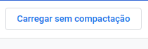

### Atenção:
#### Projeto feito com proposito de estudos, ficando o desenvolvedor insento de qualquer outra forma de utilização do codigo.

## Como usar a extensão: 
* Acesse o link : chrome://extensions/

    

* Depois ative o modo do desenvolvedor:

     

* Carregue a pasta :

     
    
